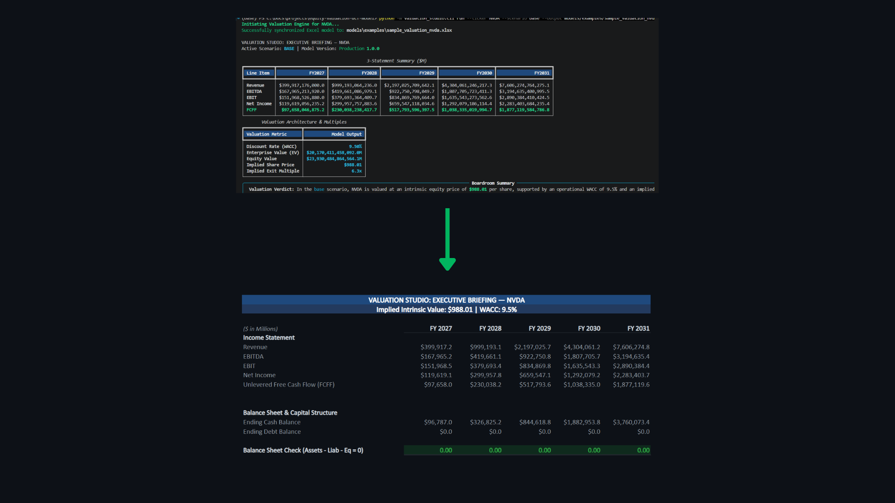

# 📈 Valuation Studio

**Institutional 3-Statement & Unlevered DCF Engine with Dynamic Excel Synchronization**

[](https://github.com/thanhan25/equity-valuation-dcf-model/actions)
[](https://github.com/thanhan25/equity-valuation-dcf-model/actions)
[](https://github.com/thanhan25/equity-valuation-dcf-model/releases)
[](https://www.python.org/)
[](https://github.com/astral-sh/ruff)
[](https://github.com/thanhan25)

<div align="center">
  
</div>

> *Bridging rigorous econometrics with production-ready software engineering. Valuation Studio replaces fragile, manual spreadsheets with a CI/CD-tested Python engine capable of programmatic scenario testing, batch equity screening, and automated Excel generation.*

---

## 🏛️ Executive Value Proposition

Most open-source financial models exist as hardcoded Jupyter notebooks that fail basic accounting identities in outer projection years. **Valuation Studio** is built to institutional standards.

It provides an automated projection engine that dynamically pulls real-time market data, calculates exact balance sheet equilibriums, and generates live, formula-driven Excel models. This allows investment committees, equity researchers, and quantitative analysts to instantly evaluate Margin of Safety, test margin expansion scenarios, and audit assumptions natively within Microsoft Excel.

## ✨ Core Capabilities

* **Dynamic Balance Sheet Equilibrium:** Implements an automated Cash and Revolver (credit facility) plug. It routes cash deficits to the revolver and cash surpluses to debt paydown, ensuring exact equality ($Assets = Liabilities + Equity$) across all projection horizons.
* **Batch Equity Screener:** Process an entire sector of tickers simultaneously (e.g., `AAPL, MSFT, NVDA`) to calculate Expected Value (EV) and isolate mispriced assets based on implied vs. market price.
* **Algorithmic Unlevered DCF:** Calculates intrinsic equity value using mid-year discounting conventions for explicit operational cash flows and precise end-of-period discounting for Gordon Growth Terminal Value.
* **Boardroom-Ready Excel Export:** Transforms numpy arrays into heavily stylized, executive-grade `.xlsx` workbooks with live formulas (`openpyxl`), allowing for seamless hand-offs to traditional finance teams.
* **Automated LaTeX Methodology:** Automatically compiles mathematical architecture reports to PDF via `pdflatex`.

---

## 🚀 Quickstart & Pipeline Execution

### 1. Installation

Clone the repository and install the engine in development mode along with its strict testing dependencies:

```bash
git clone [https://github.com/thanhan25/equity-valuation-dcf-model.git](https://github.com/thanhan25/equity-valuation-dcf-model.git)
cd equity-valuation-dcf-model
pip install -e .[dev]
pre-commit install
```

### 2. The Batch Screener (Identify Margin of Safety)

Scan a basket of equities under Base Case parameters to isolate upside and downside risk. *(Executes directly via Python module to bypass restrictive Windows/Conda PATH environments).*

```bash
python -m valuation_studio.cli screen --tickers AAPL,MSFT,NVDA,GOOGL,META --scenario base
```

### 3. Generate an Institutional Excel Model

Run the end-to-end engine for NVIDIA under the **Bull Case** scenario. This automatically fetches financials, projects the 3-statements over 5 years, runs the DCF math, and exports a synchronized `.xlsx` model.

```bash
python -m valuation_studio.cli run --ticker NVDA --scenario bull --output models/examples/sample_valuation_nvda.xlsx
```

---

## 📐 Mathematical & Accounting Architecture

### Unlevered Free Cash Flow ($FCFF$)

The quantitative engine computes cash generated by operations after accounting for reinvestment in long-term assets and working capital:

$$
FCFF = EBIT \cdot (1 - t) + D\&A - \Delta NWC - CapEx
$$

### Weighted Average Cost of Capital ($WACC$)

Discount rates are dynamically computed to reflect target capital structures, capturing the true opportunity cost of capital:

$$
WACC = \frac{E}{V} \cdot R_e + \frac{D}{V} \cdot R_d \cdot (1 - t)
$$

### Two-Variable Sensitivity Matrix

The engine programmatically calculates a $5 \times 5$ intrinsic share price grid varying $WACC$ against the Terminal Growth Rate ($g$), ensuring rigorous risk mapping and margin-of-safety analysis without manual data-table execution.

---

## 🛠️ Repository Layout

```text
equity-valuation-dcf-model/
├── models/
│   ├── template/          # Standardized Excel valuation templates
│   └── examples/          # Generated scenario models (e.g., NVDA Bull Case)
├── data/                  # Raw and standardized historical financial CSVs
├── notebooks/             # Jupyter walkthroughs for data cleaning & valuation
├── src/valuation_studio/  # Core Python package
│   ├── loaders.py         # YFinance/API ingestion & Pydantic schema validation
│   ├── statements.py      # 3-statement projection & Cash/Revolver balancing
│   ├── dcf.py             # Mid-year convention discounting & WACC matrix
│   ├── comps.py           # Peer-group EV/EBITDA multiple outlier rejection
│   ├── excel_bridge.py    # OpenPyXL compiler for stylized Excel generation
│   ├── scenarios.py       # Base/Bull/Bear parameter management
│   ├── reporting.py       # Rich terminal UI for executive summaries
│   └── cli.py             # Typer command-line interface & Screener
├── tests/                 # 92% Coverage Pytest suite verifying balance sheets
├── docs/                  # Markdown documentation & layout maps
└── scripts/
    └── make_docs.py       # Automated PDF generation (MiKTeX/pdflatex)
```

## 🧪 Testing & CI/CD Pipeline

This project is maintained to a "100% Pass" institutional standard. The pipeline enforces strict static type checking (`mypy --strict`), linting (`ruff`), and unit testing (`pytest`).

To run the test suite locally and verify balance sheet accounting identities:

```bash
python -m pytest tests/ -v
```

---

## 👤 Author & Related Projects

**An Vo** | M.Sc. Quantitative Economics Candidate, University of Bonn

*Bridging rigorous econometrics with production-ready data engineering.*

**Explore My Other Quantitative Architectures:**

* [Alpha Signal Terminal](https://github.com/thanhan25/equity-impact-predictor) - Equity Impact Predictor
* [Retail Media CLV Optimizer](https://github.com/thanhan25/retail-media-clv-optimizer) - Customer Lifetime Value Optimization
* [Trade Performance Auditor](https://github.com/thanhan25/trade-performance-auditor) - Institutional Prop Trading Latency & Slippage Audit

## 📄 License & Disclaimer

**MIT License** *Disclaimer: This software is for educational, quantitative research, and portfolio demonstration purposes only. The projected financial metrics and intrinsic valuations do not constitute investment advice. Always conduct independent due diligence before committing capital to financial markets.*
